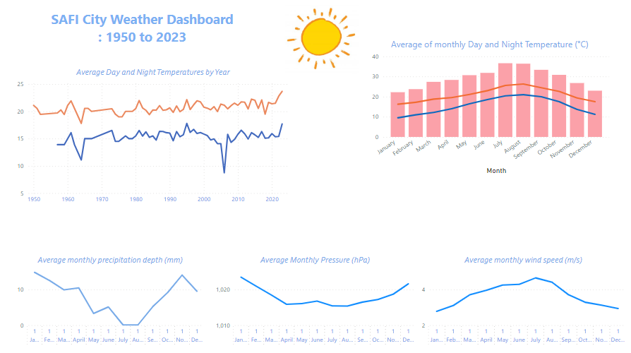

# Big Data Weather Analysis Project
# Weather Data Analysis Project

This project is dedicated to collecting, processing, and visualizing weather data sourced from the National Oceanic and Atmospheric Administration (NOAA). Leveraging Python for data manipulation and analysis, Hadoop for distributed data processing, and MapReduce for efficient data processing, the project aims to derive insights from large-scale weather datasets.

## Project Components

### Data Collection

- **NOAA NCEI Data Access:** [https://www1.ncdc.noaa.gov/](https://www1.ncdc.noaa.gov/)
- Utilize `download_data.py` to extract data from the NOAA website.
- Employ `combineFiles.py` to merge all text files into a consolidated dataset.
- Read the `documentation`  to understand the data and the emplacement of info that may concern you.

### Data Processing

#### Hadoop

Ensure Hadoop is properly installed and configured, with all necessary JAR files uploaded for executing the JAR file in Hadoop.

1. Store the `combinedfile` in HDFS.
2. Utilize MapReduce to process and aggregate data by running the JAR file `MonthlyWeatherData.jar` on the combined dataset.
   - Java is employed for the MapReduce process.
   - Calculate monthly average temperature (daytime and nighttime), precipitation depth, pressure, and wind speed.
   - Determine monthly minimum and maximum temperatures, precipitation depth, pressure, and wind speed.
3. Copy the output of the MapReduce job to the local environment.

### Data Visualization

- Utilize Power BI to create interactive dashboards for visualizing weather data.

Feel free to adjust the project description and structure to better suit your preferences and specifications.
